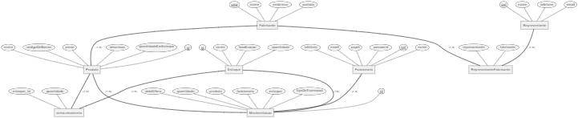
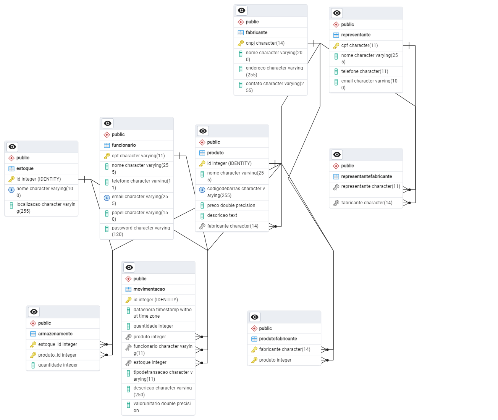
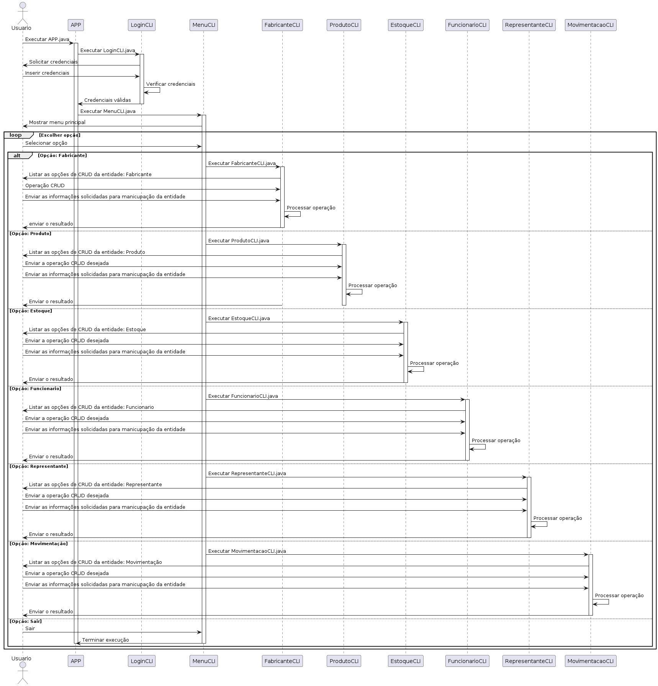

### Projeto de Sistema de Controle de Estoque
### Atividade 1
O sistema de controle de estoque deve ter as entidades Estoque, Produtos, Fabricante e Representante.
Especifique os atributos das entidades. Considere que há os papéis do gerente do almoxarifado, repositor e entregador.
Proponha um modelo Entidade-Relacionamento para o sistema de gestão de estoque.
Depois, crie um banco de dados relacional (tabelas e seus relacionamentos) para o sistema de controle de estoque.

### Documentação
### Bibliotecas Java
* Driver JDBC para Postgres para a conexão com o banco de * dados PostgreSQL
* JUnit para testes unitários dos DAO
* Maven para importações das bibliotecas
* pgcrypto do postresql para criptografia de senhas

## Requisitos
## Requisitos Funcionais
### Cadastro de Fabricantes
O sistema deve permitir o cadastro de fabricantes com as seguintes informações: CNPJ, nome, endereço e contato.
Deve ser possível visualizar, editar e remover os registros de fabricantes.

### Cadastro de Produtos
O sistema deve permitir o cadastro de produtos com as seguintes informações: ID, nome, código de barras, preço, descrição, quantidade em estoque e fabricante.
Deve ser possível visualizar, editar e remover os registros de produtos.
Cada produto deve ser associado a um fabricante existente.

### Gerenciamento de Estoques
O sistema deve permitir o cadastro de estoques com as seguintes informações: ID, nome, localização e quantidade.
Deve ser possível visualizar, editar e remover os registros de estoques.
Apresentar o relatório com informaçções dos produtos armazenados em cada estoque.


### Cadastro de Funcionários
O sistema deve permitir o cadastro de funcionários com as seguintes informações: CPF, nome, telefone, email, papel e senha.
Deve ser possível visualizar, editar e remover os registros de funcionários.

### Cadastro de Representantes
O sistema deve permitir o cadastro de representantes com as seguintes informações: CPF, nome, telefone e email.
Deve ser possível visualizar, editar e remover os registros de representantes.
Apresentar o relatório com as empresesas representadas.

### Associação de Representantes a Fabricantes
O sistema deve permitir associar representantes a fabricantes.
Deve ser possível visualizar, editar e remover essas associações.

### Gerenciamento de Armazenamento
O sistema deve permitir registrar a quantidade de produtos armazenados em cada estoque.
Deve ser possível visualizar, editar e remover esses registros.

### Movimentação de Produtos
O sistema deve permitir registrar movimentações de entrada e saída de produtos no estoque.
Cada movimentação deve incluir: data e hora, quantidade, produto, funcionário responsável, estoque envolvido e tipo de transação.
Deve ser possível visualizar, editar e remover os registros de movimentações.
Apresentar o relatório com as movimetações de produtos.

### Consultas
O sistema deve permitir consultas sobre o estado atual do estoque, movimentações, produtos, fabricantes, representantes e funcionários.

## Requisitos Não Funcionais
### Segurança
O sistema deve implementar mecanismos de autenticação e autorização para garantir que apenas usuários autorizados possam acessar e modificar dados.
As senhas dos funcionários devem ser armazenadas de forma segura, com criptografia adequada.

### Confiabilidade
O sistema deve ser robusto e minimizar a ocorrência de falhas e erros.
Deve ser implementado um sistema de backup e recuperação de dados para garantir a integridade das informações.

### Manutenibilidade
O código do sistema deve ser bem documentado e estruturado, facilitando a manutenção e a adição de novas funcionalidades.
O sistema deve ser modular, permitindo atualizações e melhorias de forma incremental.

### Banco de Dados
O sistema de Banco de dados PostgreSQL.
Inicialmente foi realizado o mapeamento das entidades por meio do modelo relacional, conforme abaixo:


### Estrutura do projeto

o projeto esta estuturado nos seguintes pacotes princiais:
* "main": contem a classe principal do projeto
* "test": contem as classes de testes unitarios das classes DAO


o pacote "main" esta estruturado nos seguintes pacotes secundarios:
* "cli":  contem as classes de interação com o usuario
* "dao": contem as classes de acesso ao banco de dados
* "database": contem as classes de conexão com o banco de dados
* "util":   contem as classes de utilidades
* "model": contem as classes de entidades
* "acl": contem as classes de controle de acesso

Todas as classes CRUD no pacote "cli" devem implametar a interface "CLIInterface" que contem os metodos de interação com o usuario para realizar as operações basicas de CRUD.


Todas as classes de entidade no pacote "dao" devem implementar a interface "DAOInterface" que contem os metodos de acesso ao banco de dados para realizar as operações basicas de CRUD.

 
 
### Modelo Entidade-Relacionamento
 




### Diagrama Entidade Relacionamento






## Menu Principal
```
1 - Produtos
2 - Funcionarios
3 - Fabricante
4 - Estoque
4 - Representante
5 - MOVIMENTACAO
0 - Sair
```
## Menu Padrao das Opções CRUDS das entidades  
``` 
0 - Sair
1 - Cadastrar <Entidade>
2 - Consultar <Entidade>
3 - Atualizar <Entidade>
4 - Excluir <Entidade>
5 - Listar <Entidade>
```
## Outras Opcoes de Menu Funcionário
```
6 - Alterar senha
7 - Alterar papel
``` 
## Outras Opcoes de Menu Funcionario
```
6 - Relacionar Fabricante ao Representante
``` 


### Implantação do projeto
1. Criar a base de dados "controledeestoque" no postgresql
2. Carrepar o arquivo "estrutura.sql" no banco de dados
3. Criar as variaveis de ambiente "pg_user" e "pg_password" com o usuario e senha do postgres respectivamente.
4. Reiniciar a IDE
5. Download das libs pelo maven por meio do arquivo "pom.xml"
6. Executar os testes unitarios para verificar se a conexão com o banco de dados esta funcionando
7. Executar o arquivo APP.java

### Fluxo de execução da aplicação
1. A classe APP.java é executada
2. A classe LoginCLI.java é executada
3. A classe MenuCLI.java é executada
4. O usuario escolhe a opção desejada que pode ser: Fabricante, Produto, Estoque, Funcionario, Representante, Movimentação ou Sair


### Exemplo de execucao
* Executar o arquivo APP.java
* Realizar o login com o usuario e senha "123123123" e senha "123123123"
* Escolher a opção 1 para acessar o menu Produto
* Escolher a opção 1 para cadastrar um produto
* Escolher a opção 5 para listar os produtos
* Escolher a opção 2 para buscar o produto pelo id "1"
* Escolher a opção 3 para atualizar o produto

* Escolher a opcao 2 para acessar o menu Funcionarios
* Escolher a opcao 5 para listar os funcionarios
* Escolher a opcao 6 para alterar a senha do funcionario "123123123"
* 