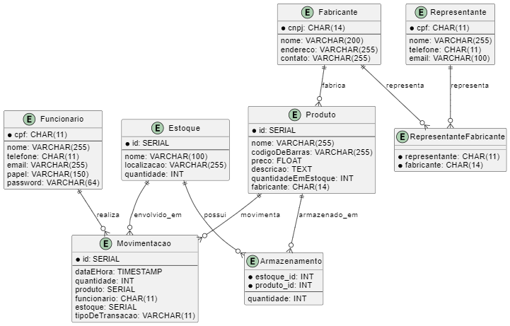

### Projeto de Sistema de Controle de Estoque
### Atividade 1
O sistema de controle de estoque deve ter as entidades Estoque, Produtos, Fabricante e Representante.
Especifique os atributos das entidades. Considere que há os papéis do gerente do almoxarifado, repositor e entregador.
Proponha um modelo Entidade-Relacionamento para o sistema de gestão de estoque.
Depois, crie um banco de dados relacional (tabelas e seus relacionamentos) para o sistema de controle de estoque.

### Documentação
### Bibliotecas Java
* Driver JDBC para Postgres para a conexão com o banco de * dados PostgreSQL
* JUnit para testes unitários dos DAO
* Maven para importações das bibliotecas
* pgcrypto do postresql para criptografia de senhas

### Requisitos
### Requisitos Funcionais
### Cadastro de Fabricantes
O sistema deve permitir o cadastro de fabricantes com as seguintes informações: CNPJ, nome, endereço e contato.
Deve ser possível visualizar, editar e remover os registros de fabricantes.

### Cadastro de Produtos
O sistema deve permitir o cadastro de produtos com as seguintes informações: ID, nome, código de barras, preço, descrição, quantidade em estoque e fabricante.
Deve ser possível visualizar, editar e remover os registros de produtos.
Cada produto deve ser associado a um fabricante existente.

### Gerenciamento de Estoques
O sistema deve permitir o cadastro de estoques com as seguintes informações: ID, nome, localização e quantidade.
Deve ser possível visualizar, editar e remover os registros de estoques.

### Cadastro de Funcionários
O sistema deve permitir o cadastro de funcionários com as seguintes informações: CPF, nome, telefone, email, papel e senha.
Deve ser possível visualizar, editar e remover os registros de funcionários.

### Cadastro de Representantes
O sistema deve permitir o cadastro de representantes com as seguintes informações: CPF, nome, telefone e email.
Deve ser possível visualizar, editar e remover os registros de representantes.

### Associação de Representantes a Fabricantes
O sistema deve permitir associar representantes a fabricantes.
Deve ser possível visualizar, editar e remover essas associações.

### Gerenciamento de Armazenamento
O sistema deve permitir registrar a quantidade de produtos armazenados em cada estoque.
Deve ser possível visualizar, editar e remover esses registros.

### Movimentação de Produtos
O sistema deve permitir registrar movimentações de entrada e saída de produtos no estoque.
Cada movimentação deve incluir: data e hora, quantidade, produto, funcionário responsável, estoque envolvido e tipo de transação.
Deve ser possível visualizar, editar e remover os registros de movimentações.

### Consultas
O sistema deve permitir consultas sobre o estado atual do estoque, movimentações, produtos, fabricantes, representantes e funcionários.

### Requisitos Não Funcionais
### Segurança
O sistema deve implementar mecanismos de autenticação e autorização para garantir que apenas usuários autorizados possam acessar e modificar dados.
As senhas dos funcionários devem ser armazenadas de forma segura, com criptografia adequada.

### Confiabilidade
O sistema deve ser robusto e minimizar a ocorrência de falhas e erros.
Deve ser implementado um sistema de backup e recuperação de dados para garantir a integridade das informações.

### Manutenibilidade
O código do sistema deve ser bem documentado e estruturado, facilitando a manutenção e a adição de novas funcionalidades.
O sistema deve ser modular, permitindo atualizações e melhorias de forma incremental.

### Banco de Dados
O sistema de Banco de dados PostgreSQL.
Inicialmente foi realizado o mapeamento das entidades por meio do modelo relacional, conforme abaixo:

 
### Modelo Entidade-Relacionamento
 


### Diagrama Entidade Relacionamento



### Execução do projeto
1. Criar a base de dados "controledeestoque" no postgresql
2. Carrepar o arquivo "estrutura.sql" no banco de dados
3. Criar as variaveis de ambiente "pg_user" e "pg_password" com o usuario e senha do postgres respectivamente.
4. Reiniciar a IDE
5. Download das libs pelo maven por meio do arquivo "pom.xml"
6. Executar os testes unitarios para verificar se a conexão com o banco de dados esta funcionando
7. Executar o arquivo APP.java


### Estrutura do projeto

o projeto esta estuturado nos seguintes pacotes princiais:
* "main": contem a classe principal do projeto
* "test": contem as classes de testes unitarios das classes DAO


o pacote "main" esta estruturado nos seguintes pacotes secundarios:
* "cli":  contem as classes de interação com o usuario
* "dao": contem as classes de acesso ao banco de dados
* "database": contem as classes de conexão com o banco de dados
* "util":   contem as classes de utilidades
* "model": contem as classes de entidades

Todas as classes CRUD no pacote "cli" devem implametar a interface "CLIInterface" que contem os metodos de interação com o usuario para realizar as operações basicas de CRUD.


Todas as classes de entidade no pacote "dao" devem implementar a interface "DAOInterface" que contem os metodos de acesso ao banco de dados para realizar as operações basicas de CRUD.

 
### Fluxo de execução
1. A classe APP.java é executada
2. A classe LoginCLI.java é executada
3. A classe MenuCLI.java é executada
4. O usuario escolhe a opção desejada que pode ser: Fabricante, Produto, Estoque, Funcionario, Representante, Movimentação ou Sair


### Elementos do Diagrama

- **Ator (Usuario)**: Representa o usuário que interage com o sistema.
- **Participantes (Classes)**:
    - `APP`: Classe principal que inicia o programa.
    - `LoginCLI`: Classe responsável pelo processo de login.
    - `MenuCLI`: Classe responsável por exibir o menu principal após o login.
    - `FabricanteCLI`, `ProdutoCLI`, `EstoqueCLI`, `FuncionarioCLI`, `RepresentanteCLI`, `MovimentacaoCLI`: Classes responsáveis pelas operações CRUD para cada entidade.

### Fluxo de Execução

1. **Início do Programa**
    
    - O usuário inicia o programa executando a classe `APP`.
    - A classe `APP` então chama a classe `LoginCLI` para iniciar o processo de login.
2. **Processo de Login**
    
    - A `LoginCLI` solicita ao usuário que insira suas credenciais.
    - O usuário fornece suas credenciais (usuário e senha).
    - A `LoginCLI` verifica as credenciais do usuário.
    - Se as credenciais são válidas, a `LoginCLI` informa à `APP` que o login foi bem-sucedido.
3. **Menu Principal**
    
    - A `APP` chama a classe `MenuCLI` para exibir o menu principal.
    - A `MenuCLI` mostra as opções disponíveis no menu para o usuário.
4. **Interação com o Menu**
    
    - O usuário seleciona uma opção no menu.
    - Dependendo da opção selecionada, a `MenuCLI` chama a classe correspondente:
        - **Fabricante**: Chama a `FabricanteCLI`.
        - **Produto**: Chama a `ProdutoCLI`.
        - **Estoque**: Chama a `EstoqueCLI`.
        - **Funcionario**: Chama a `FuncionarioCLI`.
        - **Representante**: Chama a `RepresentanteCLI`.
        - **Movimentação**: Chama a `MovimentacaoCLI`.
        - **Sair**: Finaliza a execução do programa.
5. **Operações CRUD **
    
    - **Operações CRUD**:
        - Para cada entidade (`Fabricante`, `Produto`, `Estoque`, `Funcionario`, `Representante`, `Movimentacao`), a classe correspondente (`FabricanteCLI`, `ProdutoCLI`, etc.) interage com o usuário para realizar operações de Create, Read, Update e Delete.
        - O usuário escolhe a operação desejada e fornece as informações necessárias.
        - A classe processa a operação e atualiza o banco de dados conforme necessário.
6. **Encerramento**
    
    - Se o usuário seleciona a opção "Sair", a `MenuCLI` informa à `APP` para finalizar a execução do programa.

### Detalhamento das Interações

#### Login

- **Usuario -> APP**: O usuário inicia o programa executando `APP.java`.
- **APP -> LoginCLI**: A `APP` chama `LoginCLI` para o processo de login.
- **LoginCLI -> Usuario**: A `LoginCLI` solicita as credenciais do usuário.
- **Usuario -> LoginCLI**: O usuário fornece suas credenciais.
- **LoginCLI -> LoginCLI**: A `LoginCLI` verifica as credenciais.
- **LoginCLI -> APP**: A `LoginCLI` informa que as credenciais são válidas.

#### Menu Principal e Opções

- **APP -> MenuCLI**: A `APP` chama `MenuCLI` para exibir o menu principal.
- **MenuCLI -> Usuario**: A `MenuCLI` mostra as opções do menu.
- **Usuario -> MenuCLI**: O usuário seleciona uma opção.
- **MenuCLI -> [Classe Correspondente]**: Dependendo da opção, a `MenuCLI` chama a classe correspondente para operações CRUD.

#### Operações CRUD

Para cada operação CRUD (Fabricante, Produto, Estoque, Funcionario, Representante, Movimentação):

- **MenuCLI -> [Classe Correspondente]**: Chama a classe correspondente (`FabricanteCLI`, `ProdutoCLI`, etc.).
- **[Classe Correspondente] -> Usuario**: Interage com o usuário para a operação CRUD.
- **Usuario -> [Classe Correspondente]**: Fornece informações para a operação.
- **[Classe Correspondente] -> [Classe Correspondente]**: Processa a operação e atualiza o banco de dados.
 

#### Encerramento

- **Usuario -> MenuCLI**: Seleciona a opção "Sair".
- **MenuCLI -> APP**: Informa à `APP` para finalizar a execução.
- **APP**: Termina a execução do programa.

Este diagrama de sequência detalha as interações entre o usuário e o sistema, mostrando como cada componente participa do fluxo de execução do programa.

## Menu Principal
```
1 - Produtos
2 - Funcionarios
3 - Fabricante
4 - Estoque
4 - Representante
5 - MOVIMENTACAO
0 - Sair
```
## Menu Padrao das Opções CRUDS das entidades  
``` 
0 - Sair
1 - Cadastrar <Entidade>
2 - Consultar <Entidade>
3 - Atualizar <Entidade>
4 - Excluir <Entidade>
5 - Listar <Entidade>
```
## Outras Opcoes de Menu Funcionario
```
6 - Alterar senha
7 - Alterar papel
``` 
## Outras Opcoes de Menu Funcionario
```
6 - Relacionar Fabricante ao Representante
``` 

### Exemplo de execucao
* Executar o arquivo APP.java
* Realizar o login com o usuario e senha "123123123" e senha "123123123"
* Escolher a opção 1 para acessar o menu Produto
* Escolher a opção 1 para cadastrar um produto
* Escolher a opção 5 para listar os produtos
* Escolher a opção 2 para buscar o produto pelo id "1"
* Escolher a opção 3 para atualizar o produto

* Escolher a opcao 2 para acessar o menu Funcionarios
* Escolher a opcao 5 para listar os funcionarios
* Escolher a opcao 6 para alterar a senha do funcionario "123123123"
* 